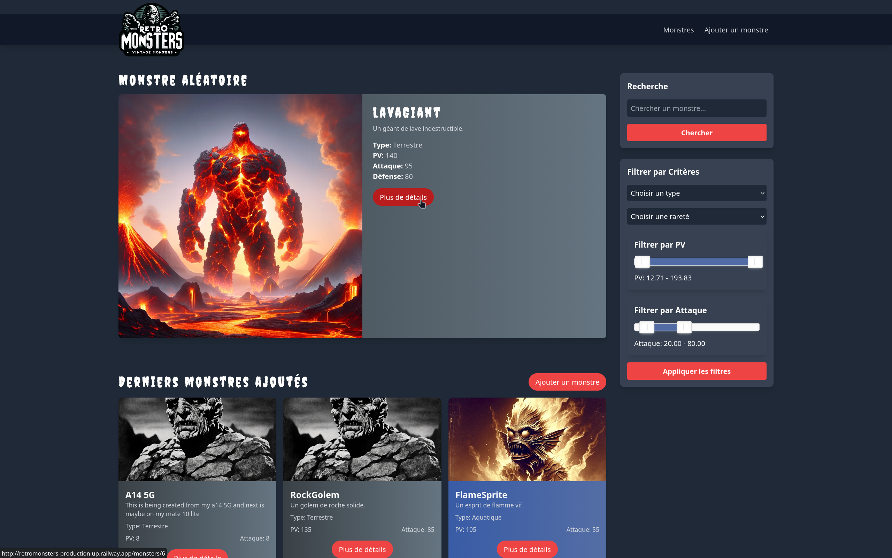
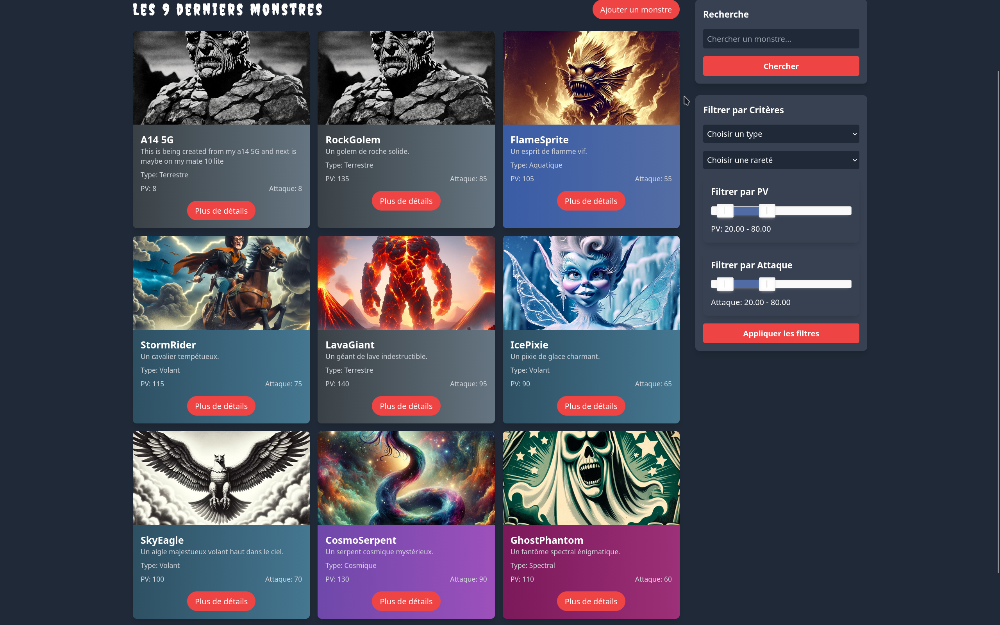
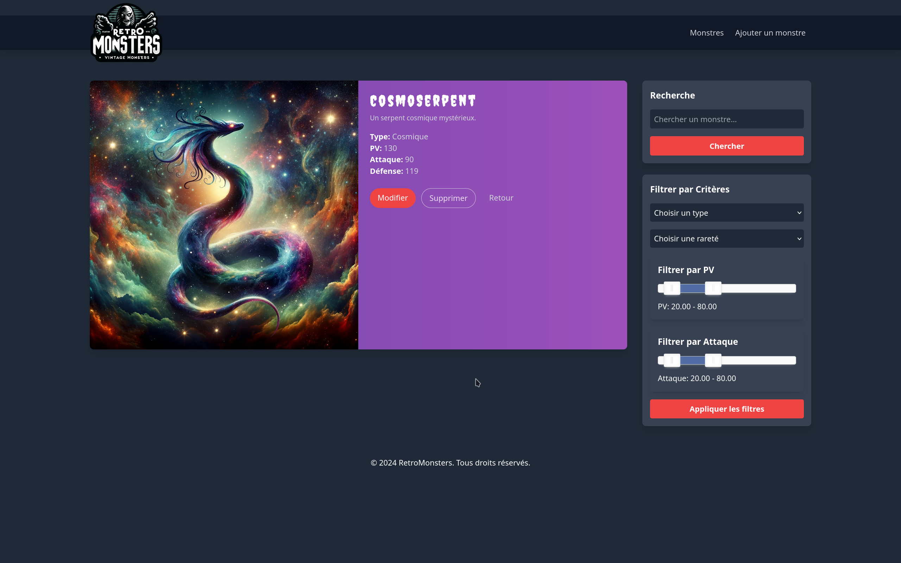
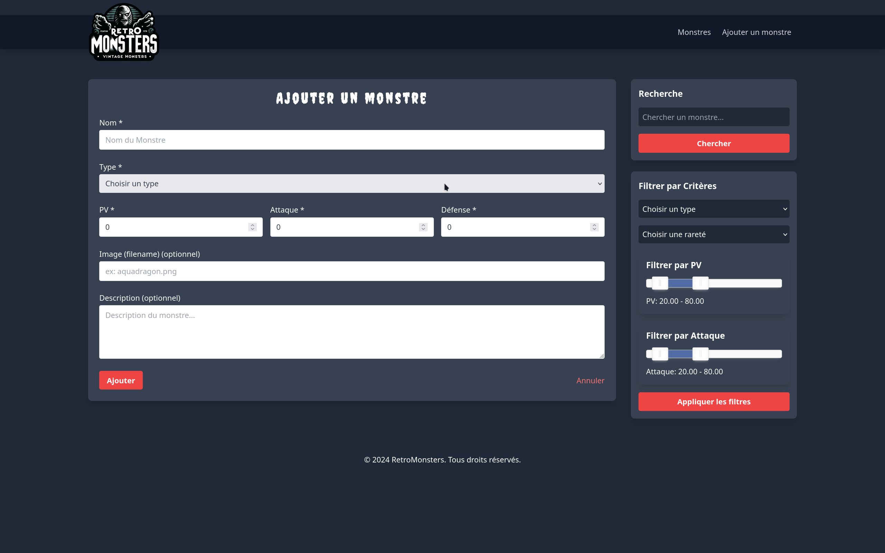

---

# 3. RetroMonsters — polished GitHub README


# RetroMonsters


RetroMonsters is a themed Laravel CRUD application for managing a fantasy monster collection.

It includes monster creation, editing, viewing, deletion, seeded sample data, and a custom retro-style interface.

***

## 🚀 Live Demo

- 🌐 Demo: [https://retromonsters-production.up.railway.app/](https://retromonsters-production.up.railway.app/)

***

# ✨ Features

- Full monster CRUD
- Homepage with random featured monster
- Latest monsters section
- Monster detail pages
- Database seeding
- Themed UI with custom styling
- Resource controller architecture

---

<!-- ## 🧠 Project Highlights

Clean Laravel resource controller setup

Custom themed interface rather than default scaffolding

Good example of CRUD fundamentals with personality

Uses seeded content to improve demo and screenshots

--- -->

## Screenshots

### Homepage


### Monsters List


### Monster Details


### Create Monster


***

# 🚀 Tech Stack

**Backend**
- PHP
- Laravel

**Frontend**
- Blade
- Tailwind CSS

**Database**
- MySQL

**Tools**
- Git
- GitHub
- Linux

***

## Installation

```bash
git clone https://github.com/yourusername/retro-monsters.git
cd retro-monsters
composer install
npm install
cp .env.example .env
php artisan key:generate
```

***

## 🗺️ Roadmap

- Add pagination

- Add filtering by monster type

- Add image upload instead of filename input

***

## 👤 Author

Built as a portfolio project to demonstrate Laravel CRUD fundamentals, custom styling, and themed application design.